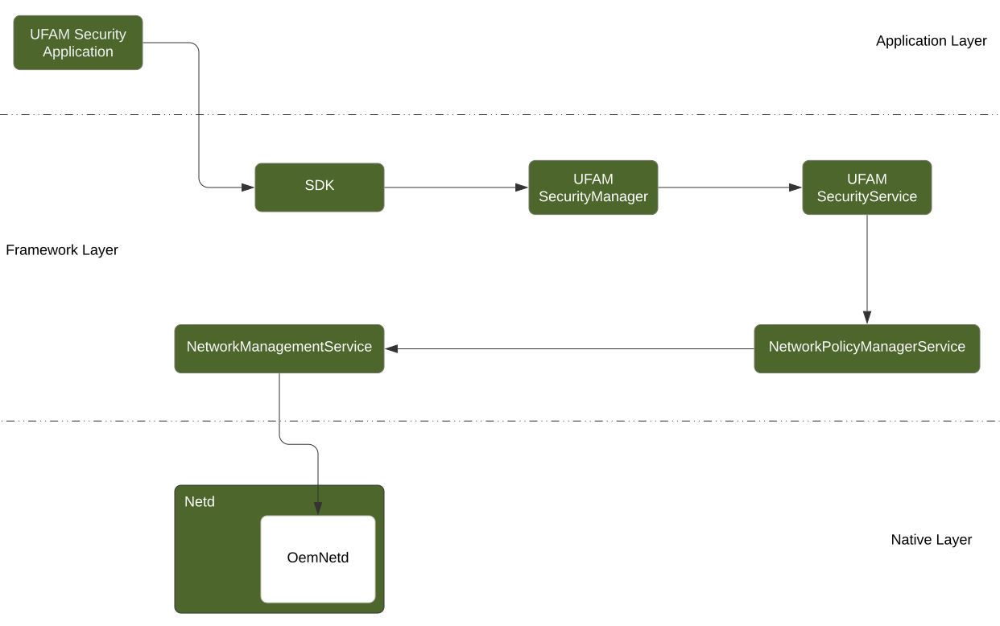
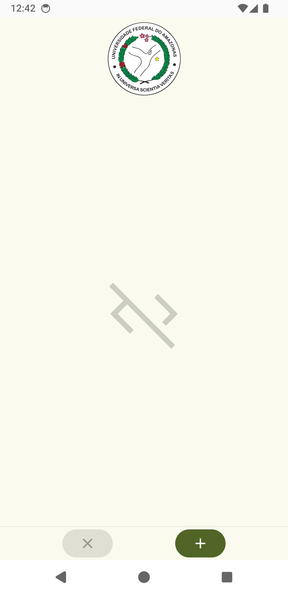
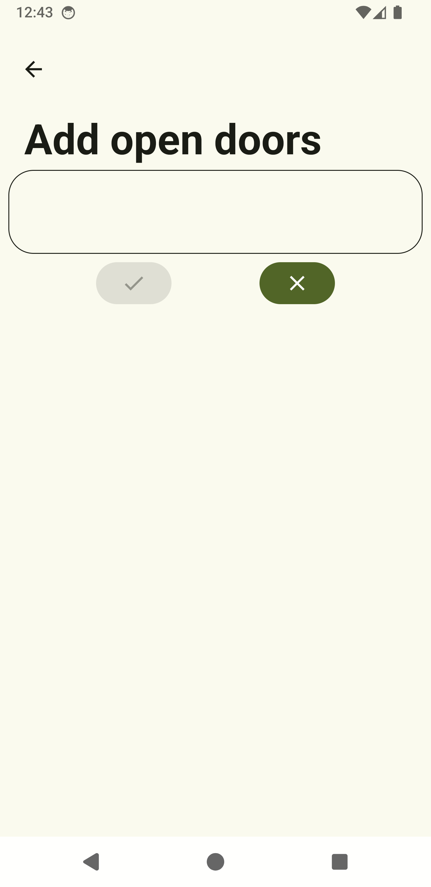
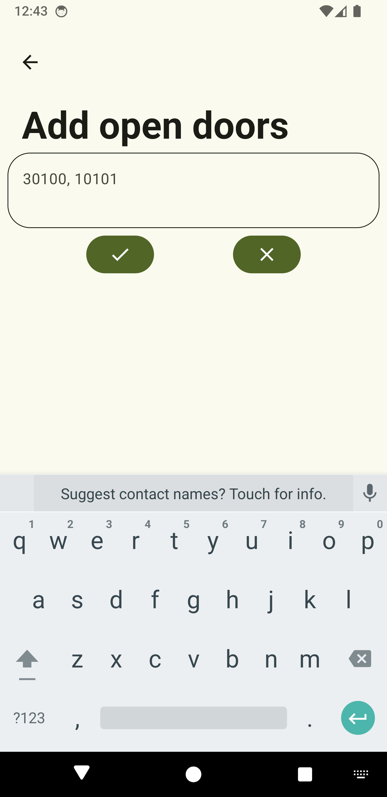
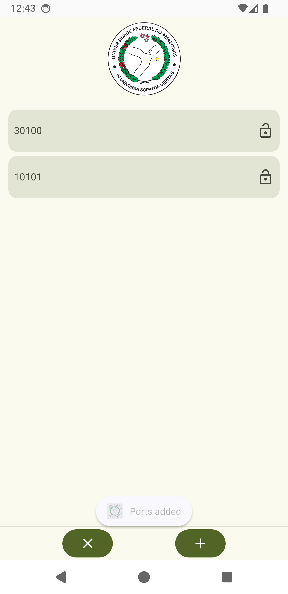

# Android Port Control


## About the project

This is my undergraduate thesis. It aims to create a mechanism that enable uses to control which network ports are open at any given moment. Only ports for *incoming* connections for the context of this work.

The project permeates (almost) all [layers](https://source.android.com/docs/core/architecture) of Android: Application, framework and native. Below is the current architecture.



We have our own Android System Service that receives the SDK calls that the application made and sends it over the implemented APIs in other Android System Services until it reaches the Netd daemon (which makes part of the [Android Network Stack](https://source.android.com/docs/core/architecture/hidl/network-stack)). The Netd daemon then hands over to OemNetd (a class implemented (sort of) by this project as well) the logic for open and closing networks ports. These rules are actually handled by [iptables](https://linux.die.net/man/8/iptables), a known interface for the Linux [netfilter](https://www.netfilter.org/) firewall.

## Getting Started with the project

This is the current directories structure

```shell
└── ufam
    ├── framework
    │   └── java
    │       └── com
    │           └── ufam
    │               └── internal
    │                   └── security
    ├── patches
    ├── scripts
    ├── sdk
    │   └── UfamSecuritySDK
    │       └── src
    │           └── java
    │               └── com
    │                   └── ufam
    │                       └── android
    │                           └── security
    │                               └── exceptions
    └── service
        └── service
            └── java
                └── com
                    └── ufam
                        └── server
                            └── security
```

* The framework directory will contain the `UFAMSecurityManager` implementation along with the `UFAMSecurityService` .aidl interface file.
* The patches directory contains the Android implementations patch files. This is due to modifications on the AOSP Source code cannot be pushed here as they have their own repositories. We generate patches with the modifications that can be applied later on.
* The scripts directory contain the scripts responsible for generating/applying/removing the patches.
* The sdk directory contains the `UFAMSecuritySDK` implementation.
* The service directory contains the the `UFAMSecurityService` implementation.

## Getting the AOSP Source Code

First, we need to install some dependencies

```shell
sudo apt install wget python3 python-is-python3
sudo apt install vim git git-core python3 python-is-python3 python-mako openjdk-8-jdk android-tools-adb bc bison build-essential curl flex g++-multilib gcc-multilib gnupg gperf imagemagick lib32ncurses-dev lib32readline-dev lib32z1-dev liblz4-tool libncurses5-dev libsdl1.2-dev libssl-dev libxml2 libxml2-utils lzop pngcrush rsync schedtool squashfs-tools xsltproc yasm zip zlib1g-dev libtinfo5 libncurses5 zip libc6-dev-i386 lib32ncurses5-dev x11proto-core-dev libx11-dev libgl1-mesa-dev screen unzip fontconfig kpartx libcurl4
```

Maybe some of the above dependencies are not necessary or have different names in the system you're in. This is for Debian based system, particularly Ubuntu 22.04 or above.

### Install repo

```shell
cd ~
mkdir -p .local/bin
cd .local/bin
wget https://storage.googleapis.com/git-repo-downloads/repo
chmod 755 repo
```

After, edit your `.bashrc` (or `.zshrc`) to export the path

```shell
export PATH="$HOME/.local/bin/:$PATH" # put this at the end of the file
```

Now, close and reopen you terminal or just

```shell
source .bashrc
```

### Prepare for AOSP syncing

```shell
cd ~
mkdir aosp
cd aosp

repo init --depth=1 -u https://android.googlesource.com/platform/manifest -b android-14.0.0_r27
```

The `--depth=1` option configures Git to download only the most current version of the source code, without downloading the entire repository history. This reduces the download size from approximately 80GB to "only" 20GB. However, after unpacking the code, the directory will be approximately 90GB. The `-u` option specifies the download URL. Finally, the `-b` option specifies the Android branch (version) to download.

### Now, lets download AOSP

```shell
repo sync -c -j$(nproc) # This will take some time, depending on your internet connection.
```

The -c (current) option will synchronize the current branch. The -j option indicates how many processors/cores to use for synchronization. Ideally, you should use the maximum number available on your system. You can see information about your processor by opening the `/proc/cpuinfo` file. Any of the commands below will show you the number of processors/cores on your system.

### Building

```shell
cd ~
cd aosp
source build/envsetup.sh && lunch sdk_phone_x86_64-eng
```

The source executes commands from a script by changing the environment of the current terminal (instead of creating a new environment for the script). The `envsetup.sh` is the script that configures a series of functions/commands in the environment that make it easier to use AOSP. This script needs to be executed every time you open a new terminal.

To properly build

```shell
m -j$(nproc) |& tee log.log # The '|& tee log.log' part of the command will write all build logs into a file called log.log
```

The build take a long time, depending on your system configs.

Once the build is finished, run the emulator

```shell
emulator &
```

## How to use this project implementation

First, clone the project https://github.com/malbolgee/ufam.git into the AOSP root directory. Then, execute the scripts to apply the patches.

```shell
cd ~
cd aosp
git clone https://github.com/malbolgee/ufam.git
cd ufam/packages/modules/ufam/scripts/

./patches_scripts_generator.sh # Execute this first, to generate the scripts that apply/generate/remove the patches.
./apply_all_patches.sh # Execute this to apply all the patches in the /ufam/packes/modules/ufam/patches/ directory.

```

Once all patches have been applied, you can build AOSP once again (this time must be much faster).

```shell
m -j$(nproc) |& tee log.log
emulator &
```

Once the emulator is running, make sure the `UFAMSecurityService` is running

```shell
adb shell service list | grep ufam
```

The output must be something like this

```shell
259	ufam_security: [com.ufam.internal.security.IufamSecurityManager]
```

### Using the UFAM Security application

Open the project located at `./aosp/ufam/packages/app/` with Android Studio and build it. Once built, install it in the running emulator. The `.apk` file will be located at `./ufam/packages/apps/UFAMSecurity/app/build/outputs/apk/debug/`

```shell
adb install app-debug.apk
```

With the app installed, go to the Add ports screen. Add some ports to be open, then the app will show the open ports (all other ports will be closed).

|  |  |
| :----------------------------------------------------------: | :----------------------------------------------------------: |
|  |  |

